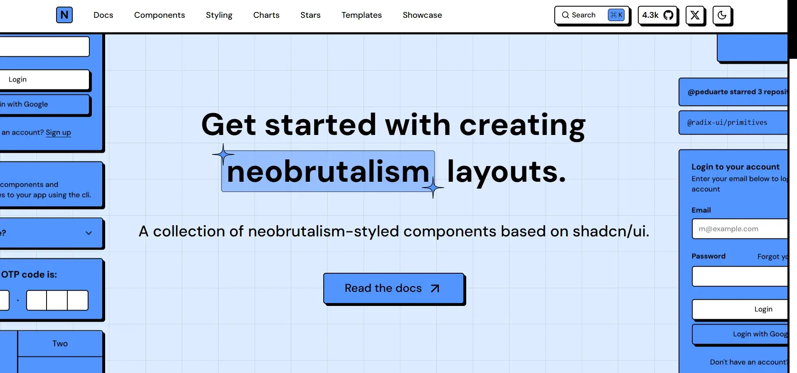
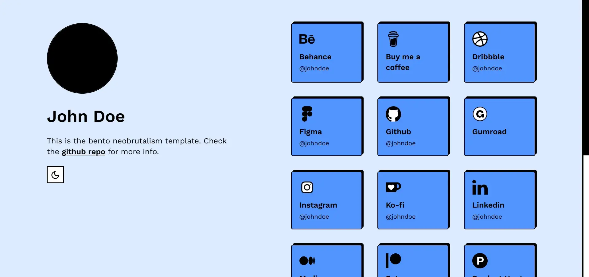
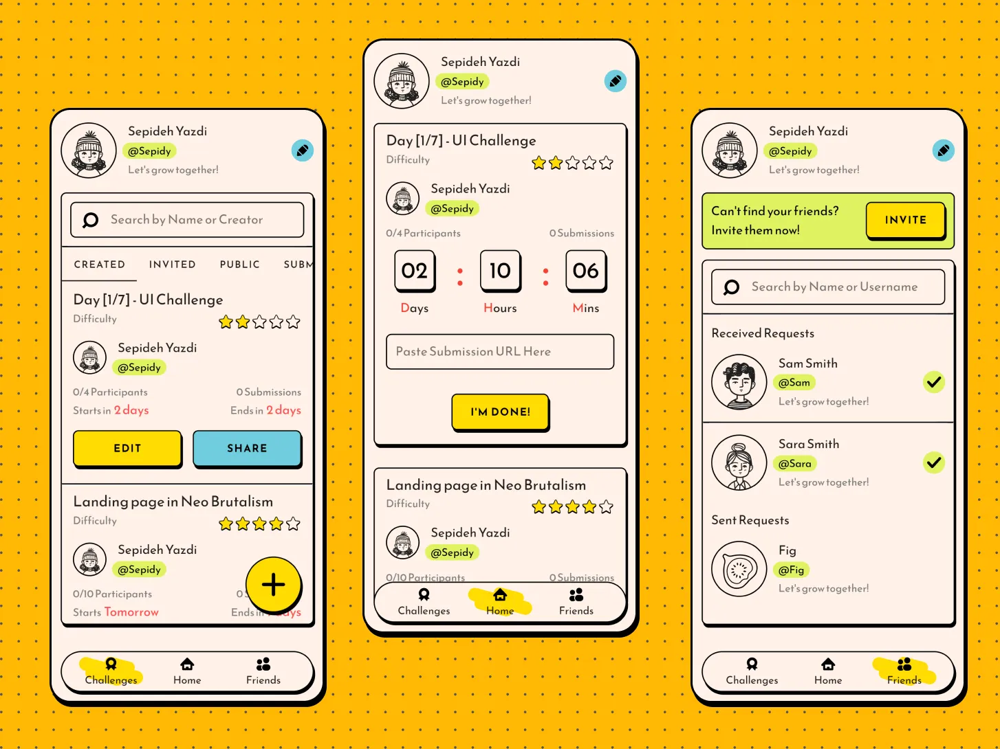
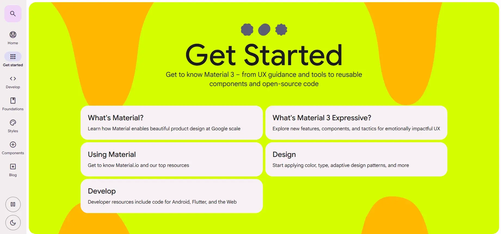

我们先来看看 [Neobrutalism components](https://www.neobrutalism.dev) 是如何定义新粗野主义的：

> Neobrutalism is a mix of regular brutalism in web design and more modern typography, illustration, and animation standards. Neobrutalism refuses the usual components of UX-UI design and embraces uncomfortable design elements, and it is more fearless to use distinctive color palettes.

虽衍生自建筑风格中的 [粗野主义](https://zh.wikipedia.org/wiki/%E7%B2%97%E9%87%8E%E4%B8%BB%E4%B9%89)，但与粗野主义中强调极简、本质的设计不同，新粗野主义摒弃了主流设计中那些模糊、柔和的渐变过渡，主张使用显著的阴影轮廓，反差冲突的色彩来展现出强烈的视觉效果。

上文所述的 Neobrutalism components 首页就能部分反映出这种设计风格。当然就新粗野主义的定义而言，其设计还是有主流设计的风格存在，例如导航栏与常规技术网站无异，只是替换了按钮样式...

包括前段时间关闭的个人主页建立工具 Bento.me 也有经新粗野主义改造后的实现，同样可以察觉出强烈甚至冲突的色彩，以及极重的按钮阴影。但与粗野主义共通的核心理念也有，都很强调功能优先设计，按钮设计让人一眼便知这是可交互的控件。

这里就不得不提 [FigChallenge](https://medium.com/@sepidy/figchallenge-story-a-community-for-designers-who-want-to-challenge-themselves-3881ab01e60b) 了，其设计师在 2023 年在 Medium 公布了这款应用的 UI 草图，被普遍认为是新粗野主义的设计典例。我觉得最大的意义是证明了新粗野主义不等同于硬朗、粗制滥造，经过精心设计一样可以利用这种风格来表达出柔和感。

不过到 3 年后的今天 FigChallenge 仍然在 Waitlist，可能这就是反主流的代价吧。

回过头看 Material Design 3 的设计风格，这不就是很标准的新粗野主义实践么...只不过实际应用在 UI 界面的设计，出于无障碍等现实考量没有做到很极致，但在设计网站上，Google 的设计师就完全放飞自我了，展现出这套设计美学的本质。

我其实有点失望，如果 Google 仍是一家 Startup，或许真实呈现给用户的 Material Design 3 设计将与现在大为不同，至少不会存在那么多的设计妥协，变成一个既不主流，也不粗野，更不现代的缝合怪设计。

前卫设计往往都是反主流、不切实际的，甚至让人直呼美学崩坏，但这正是其独特魅力所在。设计随时代前进而不断调整，或许新粗野主义终将成为设计历史上的昙花一现吧。Google 也在最近的 UI 迭代里摒弃了部分 MD3 的设计思路，变得更加主流甚至无聊了。但至少它曾在设计上激进过。